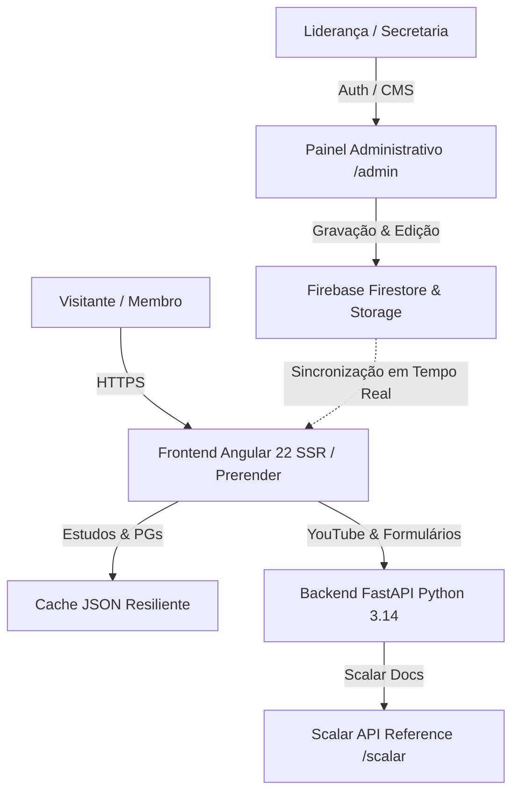

# IASD Mangueiras — Plataforma Institucional & Portal Comunitário ⛪

Repositório oficial da **Igreja Adventista do Sétimo Dia das Mangueiras (Tatuí-SP)**. Uma plataforma web moderna, acessível, segura e de alta performance projetada para acolhimento de visitantes, engajamento de membros, gerenciamento dinâmico de conteúdos (CMS) e presença digital de excelência.

---

## 🏛️ Arquitetura do Sistema



---

## 🚀 Componentes do Monorepo

| Módulo | Tecnologia | Descrição |
| :--- | :--- | :--- |
| **[`frontend/`](file:///Users/matheus.diniz_1/Documents/GitHub/IASD-Mangueiras/frontend)** | Angular 22, Tailwind CSS, SSR/Prerender | Aplicação web pública de alta performance e painel administrativo `/admin`. |
| **[`backend/`](file:///Users/matheus.diniz_1/Documents/GitHub/IASD-Mangueiras/backend)** | FastAPI, Python 3.14, Pydantic v2, uv | API assíncrona, proxy de transmissões YouTube, formulários seguros e Scalar DX. |
| **[`docs/`](file:///Users/matheus.diniz_1/Documents/GitHub/IASD-Mangueiras/docs)** | Markdown, Guias & ADRs | Documentação de arquitetura, guias de segurança, Scalar DX e roadmap futuro. |

---

## 🛡️ Governança de Segurança e Conformidade (Zero-Trust)

O projeto adota as diretrizes do **Guia de Segurança Máxima** (`docs/guides/guia-seguranca-maxima.md`):

1. **Cabeçalhos de Segurança HTTP:**
   - Injeção obrigatória de `X-Content-Type-Options: nosniff`, `X-Frame-Options: SAMEORIGIN`, `Strict-Transport-Security` e `Permissions-Policy`.
2. **Defesa em Profundidade contra Spam e DoS:**
   - Rate limiting por IP em memória thread-safe nos endpoints de envio de mensagens e pedidos de oração.
   - Sanitização de strings de entrada e normalização Unicode NFC contra ataques XSS.
3. **Regras de Firestore Blindadas:**
   - Validação estrita de tamanho e tipagem de campos em coleções públicas (`pedidos_oracao`, `pedidos_estudo`).
   - Leitura/escrita de dados administrativos e pedidos confidenciais restrita a credenciais autenticadas.
4. **Guarda de Rotas no Frontend (`authGuard`):**
   - Proteção de todas as rotas de gerenciamento (`/admin/*`) contra acesso não autorizado.
   - Modo de visualização de demonstração local para testes e desenvolvimento ágil.

---

## 📖 Documentação de API & Developer Experience (Scalar DX)

O backend implementa as diretrizes do **Guia de Padronização Scalar** (`docs/guides/guia-padrao-scalar-openapi-dx.md`):

- **Referência Interativa Scalar:** Acesse `http://localhost:8000/scalar` para explorar e testar endpoints com visual moderno, exemplos ricos e modo escuro nativo.
- **OpenAPI 3.1 Spec:** Disponível em `http://localhost:8000/openapi.json`.
- **Privacidade & Sandbox:** Assistente de IA de terceiros desativado no ambiente de produção (`AgentScalarConfig(disabled=True)`), mantendo total soberania dos dados da igreja.

---

## 🧭 Mapa de Rotas do Frontend

### Rotas Públicas
- `/`: Página inicial com destaques, próximos encontros, transmissão ao vivo e ministérios.
- `/estudos`: Central de Estudos Bíblicos, localizador de Pequenos Grupos (PGs) com filtros por perfil e bairro, Lição da Escola Sabatina com vídeos comentados e Gerador de Versículos em Canvas para Instagram Stories.
- `/horarios`: Grade de cultos semanais (sábados 9h/10h15, quartas 19h30), mapa interativo do Google Maps e FAQ.
- `/ao-vivo`: Transmissão ao vivo do culto, série especial *Presente 7* e acervo de sermões.
- `/eventos`: Agenda de programações especiais e avisos gerais.
- `/ministerios`: Apresentação dos departamentos da igreja e formulário de envolvimento voluntário.
- `/sou-novo`: Guia de acolhimento para visitantes de primeira viagem.
- `/contato`: Canais de contato, pedidos de oração e atalho direto para o WhatsApp.

### Painel Administrativo (`/admin`)
- `/admin/login`: Autenticação via Google e E-mail/Senha com atalho de demonstração local.
- `/admin`: Dashboard com métricas de eventos, avisos, PGs e pedidos de oração.
- `/admin/eventos`: Criação e edição de programações na agenda.
- `/admin/comunicados`: Publicação de banners e avisos no topo do site.
- `/admin/pgs`: Gestão completa dos Pequenos Grupos nos bairros de Tatuí.
- `/admin/oracoes`: Visualização segura da caixa de entrada de orações e intercessão.
- `/admin/horarios`: Gerenciamento de horários de cultos e avisos especiais.

---

## 🚀 Como Executar o Projeto

### Frontend (Angular 22)

```bash
cd frontend
npm install
npm start        # Inicia em http://localhost:4200
npm test         # Executa os 56 testes unitários (Vitest)
npm run build    # Gera build de produção com SSR & Prerender de 7 rotas
```

### Backend (FastAPI + Python 3.14)

```bash
cd backend
uv sync
uv run uvicorn app.main:app --reload --port 8000
uv run pytest    # Executa os 10 testes de rotas, segurança e documentação
```

---

## 📄 Licença e Direitos

Projeto desenvolvido com dedicação para a comunidade da **Igreja Adventista do Sétimo Dia das Mangueiras** em Tatuí-SP. Todos os direitos reservados.
