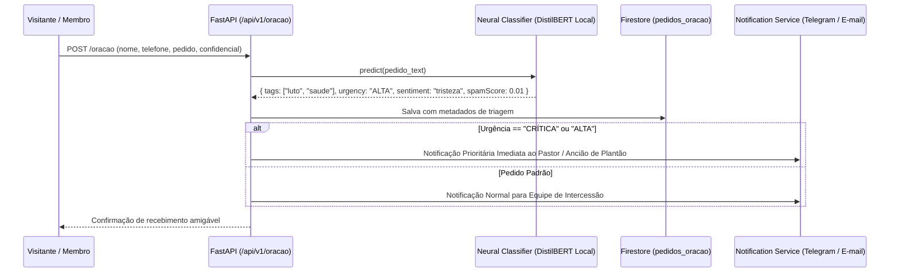

# 🧠 Roadmap de Redes Neurais & Inteligência Artificial — IASD Mangueiras

> Documento técnico e arquitetural detalhado com todas as oportunidades identificadas para enriquecimento do portal e ecossistema da **IASD Mangueiras** utilizando Redes Neurais, Machine Learning e Deep Learning (com foco em privacidade, execução local e alternativas autônomas sem dependência obrigatória de LLMs pagas).

---

## 📑 Sumário Executivo das Iniciativas

| #      | Iniciativa                                                | Domínio / Área       | Stack Tecnológica                   | Onde Executa            | Complexidade |  ROI Estimado   |
| ------ | --------------------------------------------------------- | -------------------- | ----------------------------------- | ----------------------- | :----------: | :-------------: |
| **01** | **Recomendador Semântico de PGs**                         | Estudos & PGs        | TensorFlow.js (USE)                 | Browser (Client)        |    Média     | **Entregue ✅** |
| **02** | **Triagem Neural & Moderação de Orações**                 | Pastoral / Contato   | BERT Multilingual / DistilBERT      | Backend (Python)        | Baixa-Média  |   🥇 Imediato   |
| **03** | **Enriquecedor Homilético de Versículos**                 | Estudos / Devocional | Small Seq2Seq / Flan-T5 Local       | Backend / Edge          |    Média     |     🥈 Alto     |
| **04** | **Assistente FAQ & Busca Semântica (RAG Local)**          | Geral / Visitantes   | Sentence-Transformers + Faiss       | Backend / Edge          |    Média     |     🥈 Alto     |
| **05** | **Assistente Neural de Criação no Admin (CMS Copilot)**   | Gestão / Secretaria  | T5 / Llama.cpp (Local) ou Opt-in    | Backend / Admin         |    Média     |     🥉 Alto     |
| **06** | **Previsão Preditiva de Frequência & Escalas**            | Gestão / Secretaria  | Prophet / LSTM (PyTorch)            | Backend (Offline Batch) |  Média-Alta  | 🥉 Médio-Longo  |
| **07** | **Transcrição & Indexação de Sermões (Áudio para Texto)** | Mídia / Ao Vivo      | OpenAI Whisper Local (Small/Medium) | Worker Assíncrono       |     Alta     |     🥈 Alto     |

---

## 📌 Detalhamento Técnico das Propostas

---

### 1. Triagem Neural, Análise de Sentimento e Moderação de Pedidos de Oração 🕊️

#### 🎯 Problema e Contexto

Atualmente, qualquer mensagem submetida via `/oracao` ou `/contato` é enviada diretamente por e-mail e Telegram sem qualquer filtragem prévia. Casos de **urgência espiritual/emocional extrema** (crises de ansiedade, luto agudo, ideação suicida, pedidos urgentes de visita hospitalar) competem na mesma fila com dúvidas triviais e eventuais spams.

#### 💡 Solução Neural

Implementar um **classificador neural em pipeline assíncrono** no backend Python que analisa o corpo do texto antes do despacho das notificações.

#### 🏗️ Arquitetura & Fluxo



#### 🛠️ Stack Recomendada

- **Framework:** `transformers`, `torch` (PyTorch) ou `onnxruntime` (para inferência ultra-rápida em CPU com < 15ms de latência).
- **Modelo Base:** `neuralmind/bert-base-portuguese-cased` (BERTimbau) ou `distilbert-base-multilingual-cased`.
- **Privacidade & Conformidade:** 100% On-Premise / Servidor Local. Nenhum dado confidencial sai do ambiente seguro da igreja.

#### 💻 Exemplo de Implementação no Backend

```python
# backend/app/services/prayer_moderator.py
from dataclasses import dataclass
from transformers import pipeline

@dataclass
class TriagemResult:
    urgency_level: str # 'BAIXA' | 'MEDIA' | 'ALTA' | 'CRITICA'
    sentiment: str     # 'GRATIDAO' | 'AFLICAO' | 'LUTO' | 'SAUDE' | 'FAMILIA'
    is_spam: bool
    confidence: float

class PrayerModeratorService:
    def __init__(self):
        # Pipeline carregado em CPU com modelo quantizado ONNX/PyTorch
        self.classifier = pipeline(
            "text-classification",
            model="neuralmind/bert-base-portuguese-cased",
            device=-1 # CPU
        )

    async def analyze(self, text: str) -> TriagemResult:
        # Inferência local sem chamadas externas
        ...
```

---

### 2. Enriquecedor Homilético de Versículos & Reflexões Contextuais 📖

#### 🎯 Problema e Contexto

Na aba `/estudos`, os versículos diários são estáticos. Visitantes leem o texto isolado sem uma contextualização prática rápida voltada para o momento do dia (manhã/noite) ou com conexão direta à Lição da Escola Sabatina da semana.

#### 💡 Solução Neural

Um pequeno modelo Seq2Seq (Sequence-to-Sequence) ou modelo Encoder-Decoder treinado/quantizado em português que gera 2 linhas de aplicação devocional a partir do versículo bíblico selecionado.

#### 🏗️ Arquitetura

- **Modelo:** `unicamp-dl/ptt5-small-portuguese-vocab` ou `google/flan-t5-small` quantizado em GGUF/ONNX (apenas ~150MB).
- **Entrada:** `[VERSO] Salmos 23:1-2 [HORA] Manhã [TEMA] Confiança`
- **Saída gerada:** _"Comece este dia entregando suas preocupações nos braços do Bom Pastor, descansando na certeza de que Sua provisão é suficiente para cada desafio hoje."_
- **Cache Inteligente:** Pode pré-computar as reflexões em batch uma vez ao dia no backend e salvar no cache JSON ou Firestore.

---

### 3. Assistente FAQ & Busca Bíblica Semântica (RAG 100% Local) 🔍

#### 🎯 Problema e Contexto

Visitantes novatos procuram respostas para perguntas como:

- _"Que horas começa a Escola Sabatina no sábado?"_
- _"Onde tem culto para crianças?"_
- _"Como funciona o batismo adventista?"_
- _"Tem estacionamento na igreja das Mangueiras?"_
  Hoje, o usuário precisa navegar manualmente página por página.

#### 💡 Solução Neural

Um motor de **Retrieval-Augmented Generation (RAG)** totalmente baseado em busca vetorial semântica local:

```
[Pergunta do Usuário]
         │
         ▼
[Sentence-Transformers (MiniLM Multilingual)]  <-- Gera vetor de 384 dimensões
         │
         ▼
[Índice Vetorial FAISS ou Annoy Local]         <-- Compara contra FAQ, Horários, Ministérios
         │
         ▼
[Top 3 Respostas Oficiais Mais Aderentes]       <-- Apresenta o card exato com link de ação
```

#### 🛠️ Stack Recomendada

- **Vetorização:** `sentence-transformers/paraphrase-multilingual-MiniLM-L12-v2` (roda em <50ms no backend).
- **Indexador Vetorial:** `faiss-cpu` (Facebook AI Similarity Search) ou busca vetorial em memória via NumPy.
- **Base de Conhecimento:** Arquivos Markdown em `docs/knowledge/` alimentados pela secretaria (horários, doutrinas bíblicas fundamentais, eventos, ministérios).

---

### 4. Assistente Neural de Criação no Painel Administrativo (CMS Copilot) ✍️

#### 🎯 Problema e Contexto

Líderes de departamentos e secretários muitas vezes demoram para redigir títulos cativantes, descrições informativas e chamadas para eventos ou comunicados no painel `/admin`.

#### 💡 Solução Neural

Adicionar um botão **"✨ Expandir Descrição / Sugerir Chamada"** nos formulários de eventos e comunicados:

1. O líder digita apenas o rascunho básico: `"Culto JA sábado 17h com tema amizade cristã e lanche comunitário"`.
2. O modelo expande estruturadamente:
   - **Título sugerido:** _"Encontro Jovem: Laços de Amizade & Comunhão"_
   - **Descrição formatada:** Texto acolhedor, público-alvo, itens para trazer e versículo tema.
   - **Tag do Departamento:** Sugestão automática de `"Jovens (JA)"`.

#### 🛠️ Stack Recomendada

- Executável local via `llama-cpp-python` com modelo `Qwen2.5-1.5B-Instruct` quantizado em 4-bit (~1GB RAM) ou `Flan-T5-Base`.

---

### 5. Previsão Preditiva de Frequência e Escalas Litúrgicas 📈

#### 🎯 Problema e Contexto

A liderança da igreja precisa planejar a quantidade de materiais da Escola Sabatina, quantidade de recepcionistas e voluntários do diaconato para eventos especiais, mas não tem histórico quantitativo nem previsões.

#### 💡 Solução Neural / Estatística

Treinar uma **Rede Neural Recorrente (LSTM / GRU)** ou modelo aditivo de séries temporais (**Prophet** da Meta):

- **Inputs:** Data, dia da semana, se é primeiro sábado do mês (Santa Ceia), se há palestra especial, histórico de escalas e eventos cadastrados.
- **Outputs:**
  - Estimativa de público no sábado (ex: `185 a 210 pessoas`).
  - Alerta de sobrecarga em oficiais da escala (ex: _"Carlos Silva já está escalado na Recepção e no Som no mesmo horário"_).
- **Visualização:** Widget preditivo no `/admin/dashboard`.

---

### 6. Transcrição & Indexação Semântica de Sermões e Áudios (Whisper Local) 🎙️

#### 🎯 Problema e Contexto

A igreja transmite cultos no YouTube e possui um grande acervo de pregações gravadas, mas os membros não conseguem buscar sermões por tópicos específicos ditos dentro do vídeo.

#### 💡 Solução Neural

- Um job assíncrono em background (FastAPI task) baixa o áudio do vídeo recém-transmitido do canal da IASD Mangueiras.
- Executa o **OpenAI Whisper Local (modelo `small` ou `medium` para PT-BR)** offline.
- Gera a transcrição com marcação de tempo (timestamps) e extrai os principais textos bíblicos citados.
- Salva no Firestore: os membros poderão pesquisar na página `/ao-vivo` por termos como _"sermão que falou sobre Daniel 8"_ e o vídeo abrirá no segundo exato da mensagem.

---

## 🗺️ Matriz de Priorização & Roadmap de Execução

```
        ▲ ALTO
        │
        │      [01. Recomendador PGs] ✅
        │      [02. Moderação de Orações] 🥇      [03. Versículo Seq2Seq] 🥈
        │
IMPACTO │
        │      [04. FAQ Semântico RAG] 🥈        [07. Transcrição Sermões]
        │      [05. CMS Copilot Admin] 🥉        [06. Previsão Frequência]
        │
        └───────────────────────────────────────────────────────────────►
          BAIXA                     COMPLEXIDADE                    ALTA
```

---

## 🔒 Diretrizes Éticas e Governança Adventista

1. **Princípio da Privacidade Estrita:** Dados de pedidos de oração confidenciais **jamais** devem trafegar para serviços de terceiros sem autorização explícita. Qualquer inteligência aplicada a pedidos pastorais deve ser **100% on-premise/local**.
2. **Supervisão Humana (Human-in-the-loop):** Nenhuma decisão pastoral ou envio de comunicação externa é realizado de forma 100% autônoma; a IA atua estritamente como ferramenta de apoio à tomada de decisão da liderança.
3. **Fidelidade Doutrinária:** Qualquer modelo gerador de texto ou busca deve ter como corpus de validação as 28 Crenças Fundamentais Adventistas e a Bíblia Sagrada.
