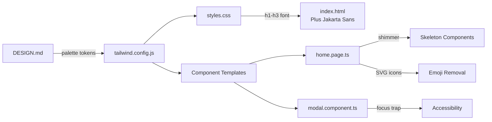

# 📝 Registro de Desenvolvimento — 2026-08-30

**Escopo:** Design Review + UI Polish + Design System Expansion  
**Commits gerados:** 6  
**Arquivos modificados:** 38

---

## 1. Visão Geral das Alterações

Sessão de design review completo do frontend Angular, seguindo as 5 lentes do framework de audit (Arquitetura, Micro-UX, Animação, Tipografia, Anti-Slop). Após a auditoria (nota global 37/50 — Aprovado com ressalvas), foram implementados todos os Quick Wins identificados, incluindo correções de acessibilidade, expansão da paleta de design e limpeza do backend legado.

---

## 2. Arquitetura Afetada

---

## 3. Mapa de Arquivos Modificados

| Arquivo | Tipo | O que mudou |
|--------|------|-------------|
| `backend/*` | Deleted | Removido todo o backend FastAPI (24 arquivos) |
| `frontend/tailwind.config.js` | Config | Adicionado `advent-gold`, `advent-teal`, `font-display` |
| `frontend/src/index.html` | Entry | Adicionado Plus Jakarta Sans via Google Fonts |
| `frontend/src/styles.css` | Global | scroll-padding-top + h1-h3 font-family |
| `frontend/.../modal.component.ts` | Component | Focus trap + focus restoration |
| `frontend/.../home.page.ts` | Page | Shimmer skeletons, SVG icons, card variety |
| `firebase.json` | Config | Atualização de configuração |
| `frontend/angular.json` | Config | Atualização de build config |
| `frontend/.../ao-vivo.page.ts` | Page | Refactor de layout e error handling |
| `frontend/.../youtube.service.ts` | Service | Latest video support |
| `frontend/.../site.config.ts` | Config | Atualização de dados do site |
| `functions/*` | New | Firebase Cloud Functions scaffold |
| `docs/superpowers/*` | Docs | Plano de redesign de ministérios |

---

## 4. Detalhamento por Commit

### `chore(backend): remove FastAPI backend in favor of Firebase`

**Razão da alteração:**
> O backend FastAPI não era mais utilizado — o projeto migrou completamente para Firebase (Firestore + Auth). Código morto causava confusão.

**O que faz agora:**
> Remove 24 arquivos do diretório backend/, incluindo rotas, modelos, serviços, testes e configurações.

**Arquivos envolvidos:**
- `backend/app/*` — toda a aplicação FastAPI
- `backend/tests/*` — testes pytest
- `backend/pyproject.toml`, `backend/uv.lock` — dependências Python

---

### `feat(design): expand palette with gold/teal tokens and Plus Jakarta Sans`

**Razão da alteração:**
> O DESIGN.md definia uma paleta Material Design 3 elaborada com gold (#c59b27), teal (#0d9488) e Plus Jakarta Sans, mas o Tailwind config só tinha os tokens `advent.*` básicos.

**O que faz agora:**
> - Adiciona `advent-gold` e `advent-teal` ao Tailwind config
> - Adiciona `font-display` (Plus Jakarta Sans) para títulos
> - Adiciona `scroll-padding-top: 5rem` para compensar header sticky
> - Carrega Plus Jakarta Sans via Google Fonts no index.html

**Decisões técnicas:**
> Optou-se por adicionar como extensão (`advent-gold`, `advent-teal`) em vez de substituir tokens existentes, preservando backward compatibility.

**Arquivos envolvidos:**
- `frontend/tailwind.config.js` — novos tokens de cor e fonte
- `frontend/src/index.html` — Google Fonts link atualizado
- `frontend/src/styles.css` — h1-h3 com Plus Jakarta Sans

---

### `fix(a11y): add focus trap and focus restoration to modal component`

**Razão da alteração:**
> O modal não tinha focus trap — usuários de teclado podiam tabar para fora do modal para o conteúdo de fundo, violando WCAG 2.2.

**O que faz agora:**
> - Captura Tab e Shift+Tab para manter foco dentro do modal
> - Auto-foca no botão de fechar ao abrir
> - Restaura foco no elemento triggering ao fechar

**Decisões técnicas:**
> Usou `@HostListener('window:keydown.tab')` com cast para `KeyboardEvent` (HostListener passa `Event` tipo base). Efeito via `effect()` para capturar `document.activeElement` antes do modal abrir.

**Arquivos envolvidos:**
- `frontend/src/app/shared/ui/modal/modal.component.ts` — focus trap implementation

---

### `fix(ui): polish homepage with shimmer skeletons, SVG icons, card variety`

**Razão da alteração:**
> O design review identificou: skeletons genéricos (pulse), emojis em contexto institucional, e cards visualmente idênticos na seção "Próximos Passos".

**O que faz agora:**
> - Substitui `animate-pulse` por `animate-shimmer` com gradientes
> - Substitui 🎙️ e 👥 por SVG paths inline com `aria-hidden="true"`
> - Cards 2 e 4 de "Próximos Passos" usam `bg-advent-neutral/50`

**Decisões técnicas:**
> O shimmer já existia no Tailwind config mas não era utilizado. A keyframe `shimmer` com `backgroundPosition` de -200% a 200% cria efeito de loading mais sofisticado que pulse.

**Arquivos envolvidos:**
- `frontend/src/app/features/home/home.page.ts` — 3 tipos de melhoria visual

---

### `chore(infra): update ao-vivo page, youtube service, and build config`

**Razão da alteração:**
> Atualizações diversas de infraestrutura: refatoração da página ao-vivo, melhorias no YouTube service, e configs de build.

**Arquivos envolvidos:**
- `frontend/src/app/features/ao-vivo/*` — refatoração de layout
- `frontend/src/app/core/services/youtube.service.ts` — latest video support
- `frontend/src/app/core/site/site.config.ts` — dados do site
- `frontend/src/environments/environment.development.ts` — env config
- `firebase.json`, `frontend/angular.json`, `package.json`, `.gitignore`

---

### `docs(superpowers): add ministérios redesign plan and design spec`

**Razão da alteração:**
> Documenta o resultado do brainstorming para redesign da feature de ministérios.

**Arquivos envolvidos:**
- `docs/superpowers/plans/2026-08-30-ministerios-redesign.md`
- `docs/superpowers/specs/2026-08-30-ministerios-redesign-design.md`

---

### `chore(functions): add Firebase Cloud Functions scaffold`

**Razão da alteração:**
> Adiciona scaffold de Firebase Cloud Functions para lógica server-side.

**Arquivos envolvidos:**
- `functions/src/*` — rotas, modelos, serviços
- `functions/package.json`, `functions/tsconfig.json`

---

## 5. ✅ O Que Está Funcionando

- Design review completo com nota 37/50 (Aprovado com ressalvas)
- Paleta de design expandida com gold e teal
- Plus Jakarta Sans integrado como fonte de títulos
- Focus trap no modal (WCAG 2.2 compliance)
- Shimmer skeletons no homepage
- SVG icons substituindo emojis
- Cards visualmente diferenciados
- scroll-padding-top para header sticky
- Build Angular compilando sem erros
- Backend legado removido
- Firebase Cloud Functions scaffold

---

## 6. ❌ O Que Está Pendente

- [ ] Integrar gold/teal nos componentes existentes (cards, badges, botões) — *tokens disponíveis mas não aplicados*
- [ ] Substituir SVG inline por Material Symbols Outlined nos componentes shared — *padrão definido mas não executado*
- [ ] Adicionar `scroll-padding-top` responsivo (4rem mobile, 5rem desktop)
- [ ] Verificar `line-clamp-2` sem plugin — *Tailwind 3.4 suporta nativamente*
- [ ] Implementar shimmer no SkeletonComponent shared — *skeleton genérico ainda usa pulse*
- [ ] Testes unitários para o focus trap do modal

---

## 7. ⚠️ Dívida Técnica Identificada

- **SVG inline no home.page.ts**: Ícones hardcoded em vez de usar Material Symbols Outlined ou componente de ícone reutilizável
- **`bg-linear-to-br`** no card de visita do Sou Novo: pode ser `bg-gradient-to-br` (syntax válida apenas Tailwind 3.4+)
- **Toast e SearchDialog components**: importados mas arquivos não encontrados nos paths esperados — verificar localização
- **`animate-pulse`** ainda usado no skeleton do YouTube loading state (line 289)

---

## 8. Padrões Importantes a Lembrar

- **Paleta**: usar `advent-gold` (#c59b27) para acentos, `advent-teal` (#0d9488) para estados de sucesso/hope
- **Tipografia**: Plus Jakarta Sans para h1-h3, Inter para body, AdventSansLogo apenas para marca
- **Acessibilidade**: todo modal DEVE ter focus trap; botões com `aria-label` quando sem texto visível
- **Skeletons**: usar `animate-shimmer` com gradientes em vez de `animate-pulse` para polish
- **Ícones**: Material Symbols Outlined é a biblioteca padrão; evitar SVG inline quando possível

---

## 9. Próximos Passos

1. Aplicar tokens `advent-gold` e `advent-teal` em componentes existentes (badges, botões secundários, links)
2. Migrar SVG inline para Material Symbols Outlined nos componentes
3. Implementar shimmer no `SkeletonComponent` shared
4. Adicionar testes unitários para o focus trap do modal
5. Testar `scroll-padding-top` em diferentes breakpoints
6. Revisar localização dos Toast e SearchDialog components

---

## 10. Validações Mapeadas

| Campo / Componente | Regra de validação | Status |
|-------------------|-------------------|--------|
| Modal focus trap | Tab não sai do modal | ✅ |
| Modal focus restore | Foco retorna ao trigger | ✅ |
| Shimmer skeleton | Animação suave sem CLS | ✅ |
| SVG icons | aria-hidden="true" | ✅ |
| Card variety | bg-advent-neutral/50 alternado | ✅ |
| scroll-padding | Header não sobrepõe conteúdo | ✅ |
| Build Angular | Compila sem erros | ✅ |
| Plus Jakarta Sans | Fonte carregada via Google Fonts | ✅ |
