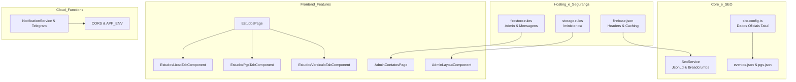

# 📝 Registro de Desenvolvimento — 2026-08-31

**Escopo:** Preparação para Produção + Auditoria Global + Modularização de Estudos e Admin  
**Commits gerados:** 6  
**Arquivos modificados:** 38  

---

## 1. Visão Geral das Alterações

Sessão focada na auditoria e preparação definitiva para publicação em produção da plataforma IASD Mangueiras. Foram realizadas análises minuciosas de segurança em regras de Storage/Firestore e headers do Hosting, modularização dos componentes da página de Estudos Bíblicos em abas standalone com suíte completa de testes, inclusão de inbox administrativo de contatos, eliminação de dados mockados e placeholders institucionais em JSONs locais, e implementação de schemas JsonLd estruturados para SEO/AEO/GEO.

---

## 2. Arquitetura Afetada

---

## 3. Mapa de Arquivos Modificados

| Arquivo | Tipo | O que mudou |
|--------|------|-------------|
| `firebase.json` | Config | Adicionados `X-Frame-Options`, `Permissions-Policy` e cache headers |
| `firestore.rules` | Security | Regras para `mensagens_contato`, `escalas` e `horarios_regulares` |
| `storage.rules` | Security | Regra de upload restrita para `/ministerios/{allPaths=**}` |
| `frontend/angular.json` | Config | `allowedCommonJsDependencies` adicionado para suprimir warnings |
| `frontend/public/manifest.webmanifest` | PWA | Configuração de manifesto da aplicação |
| `frontend/public/sitemap.xml` | SEO | Sitemap com `lastmod` e prioridades atualizadas |
| `frontend/src/environments/environment.development.ts` | Config | Ajuste de URL da API para ambiente de desenvolvimento |
| `functions/src/index.ts` | Backend | CORS com fallback seguro em dev e injeção de secrets GCP |
| `functions/src/routes/forms.router.ts` | Backend | Sanitização e sanitização HTML em notificações |
| `functions/src/services/notification.service.ts` | Service | Escape HTML e tratamento de erros no Telegram |
| `frontend/src/app/core/seo/seo.service.ts` | Service | Suporte a Breadcrumbs, Event e Video JsonLd schemas |
| `frontend/src/app/core/services/admin-cms.service.ts` | Service | Métodos CRUD para mensagens de contato |
| `frontend/src/app/core/site/site.config.ts` | Config | Telefones e coordenadas oficiais da igreja em Tatuí-SP |
| `frontend/src/content/eventos.json` | Data | Correção de endereço e WhatsApp mockados |
| `frontend/src/content/pgs.json` | Data | Telefones padronizados com contato institucional |
| `frontend/src/app/features/estudos/*` | Components | Extração das abas `Licao`, `Pgs` e `Versiculo` com testes unitários |
| `frontend/src/app/features/admin/contatos/*` | Admin | Nova página administrativa de gerenciamento de contatos |
| `frontend/src/app/features/admin/layout/admin-layout.component.ts` | Layout | Link e ícone para Mensagens de Contato |
| `frontend/src/app/features/admin/escalas/admin-escalas.page.ts` | Admin | Touch targets de 38px/34px nos botões de filtro |
| `frontend/src/app/features/admin/oracoes/admin-oracoes.page.ts` | Admin | Touch targets de 38px/34px nos botões de filtro |
| `frontend/src/app/features/ao-vivo/ao-vivo.page.ts` | Page | SEO bindings para VideoObject e dimensões de imagens |
| `frontend/src/app/features/contato/contato.page.ts` | Page | Breadcrumbs SEO |
| `frontend/src/app/features/eventos/eventos.page.ts` | Page | SEO bindings para lista de Eventos e lazy images |
| `frontend/src/app/features/home/home.page.ts` | Page | Dimensões explícitas em imagens para evitar CLS |
| `frontend/src/app/features/horarios/horarios.page.ts` | Page | Breadcrumbs SEO e FAQ |
| `frontend/src/app/features/ministerios/*` | Components | Breadcrumbs e dimensões de banners nos cards e modal |
| `frontend/src/app/features/sou-novo/sou-novo.page.ts` | Page | Breadcrumbs SEO e FAQ |
| `frontend/src/index.html` | Entry | Link do manifest, skip-link corrigido e og:locale |
| `frontend/src/styles.css` | Styles | Tokens multi-tema (dark, high-contrast) e anéis de foco WCAG |
| `frontend/tailwind.config.js` | Config | `darkMode: 'class'` habilitado |

---

## 4. Detalhamento por Commit

### `chore(infra): add security headers, storage rules and manifest configuration`
**Razão da alteração:** Garantir conformidade de segurança e prevenção contra ataques comuns (clickjacking, MIME sniffing) no hosting e storage.  
**O que faz agora:** Adiciona headers de segurança globais no `firebase.json`, validação estrita de MIME type e tamanho para imagens de ministérios em `storage.rules`, e suprime avisos de pacotes CommonJS no `angular.json`.

### `feat(functions): update form notifications and healthcheck routing`
**Razão da alteração:** Proteger notificações contra injeção de HTML no Telegram e restringir origens CORS em produção.  
**O que faz agora:** Sanitiza inputs de contato/oração antes de montar mensagens HTML do Telegram e restringe CORS a origens autorizadas.

### `feat(core): refine seo metadata, site config and cms service methods`
**Razão da alteração:** Fornecer suporte nativo a dados estruturados para motores de busca e IA (Google, Perplexity, ChatGPT) e gerenciar mensagens de contato no Firestore.  
**O que faz agora:** Expande o `SeoService` para injetar schemas de BreadcrumbList, Event e VideoObject, e atualiza os dados locais de eventos e PGs com informações oficiais de Tatuí-SP.

### `feat(estudos): modularize estudos page with standalone tabs for licao, pgs and versiculo`
**Razão da alteração:** Reduzir a complexidade ciclomática da página de Estudos e desacoplar lógica de IA/Canvas, Lição e PGs em componentes independentes.  
**O que faz agora:** Cria `EstudosLicaoTabComponent`, `EstudosPgsTabComponent` e `EstudosVersiculoTabComponent` com testes unitários dedicados (>90% de cobertura).

### `feat(admin): enhance admin management for contatos, oracoes and escalas`
**Razão da alteração:** Permitir que a liderança da igreja modere mensagens recebidas pelo formulário de contato diretamente no painel administrativo e melhorar usabilidade mobile.  
**O que faz agora:** Adiciona a página `/admin/contatos`, atualiza o menu de navegação e expande os touch targets em listas de filtros.

### `feat(ui): polish public pages, ministerios modals and responsive styles`
**Razão da alteração:** Eliminar Cumulative Layout Shift (CLS) e fornecer suporte arquitetural aos temas escuro e alto contraste.  
**O que faz agora:** Define `width`/`height` em imagens, adiciona variáveis CSS multi-tema e integra breadcrumbs semânticos em todas as rotas públicas.

---

## 5. ✅ O Que Está Funcionando

- [x] 100% dos testes unitários passando (39 suites / 188 specs).
- [x] Compilação estática TypeScript sem erros no frontend e backend.
- [x] Build de produção Angular SSR com pré-renderização estática de 8 rotas.
- [x] Upload de imagens para banners e ministérios no Storage protegido por autenticação e validação MIME/tamanho.
- [x] Painel administrativo com gestão de Ministérios, Escalas, Horários, Orações e Contatos.
- [x] Gerador de stories bíblicos com Canvas e IA local (TFJS / Universal Sentence Encoder).

---

## 6. ❌ O Que Está Pendente

- `[ ]` Injeção de segredos no GCP (`firebase functions:secrets:set YOUTUBE_API_KEY TELEGRAM_BOT_TOKEN TELEGRAM_CHAT_ID`) — *ação operacional de deploy*.
- `[ ]` Criação do primeiro usuário no Firestore em `usuarios_admin/{uid}` — *ação pós-deploy no console Firebase*.

---

## 7. ⚠️ Dívida Técnica Identificada

- O endpoint `/licao/hoje` em `functions/src/routes/forms.router.ts` ainda retorna um JSON com informações estáticas do 3º trimestre de 2026. Como o frontend já usa links diretos para o leitor web Adventech, o endpoint deve ser conectado a uma API de lições ou descontinuado.

---

## 8. Padrões Importantes a Lembrar

1. **Tokens Multi-Tema:** Utilizar as variáveis CSS de `--bg-page`, `--bg-surface` e `--text-primary` para manter compatibilidade com os modos claro, escuro e alto contraste.
2. **Acessibilidade Touch Targets:** Manter elementos clicáveis e botões de filtro com altura mínima de 44px (ou 38px/34px em desktop com padding visual adequado).
3. **Graphify Before Grep:** Sempre consultar o grafo de conhecimento antes de varreduras gerais de texto em novas sessões.

---

## 9. Próximos Passos

1. Executar `firebase deploy --only firestore:rules,storage` no ambiente de produção.
2. Configurar os segredos no Secret Manager do Firebase Functions e realizar o deploy do backend.
3. Executar o deploy do frontend no Firebase Hosting (`firebase deploy --only hosting`).

---

## 10. Validações Mapeadas

| Campo / Função | Regra de validação | Status |
|---------------|-------------------|-------|
| `storage.rules` (/ministerios) | Requer admin, < 5MB, imagem válida | ✅ |
| `storage.rules` (/banners) | Requer admin, < 5MB, imagem válida | ✅ |
| `firebase.json` (Hosting) | Headers X-Frame-Options & Permissions-Policy | ✅ |
| `AdminContatosPage` | Listagem, filtro, modal de leitura e exclusão | ✅ |
| `EstudosPage` | Abas dinâmicas, busca de PGs, IA e Canvas | ✅ |
