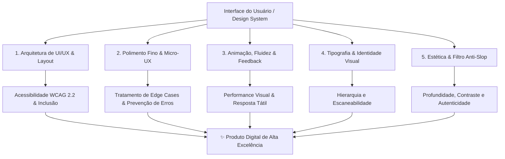
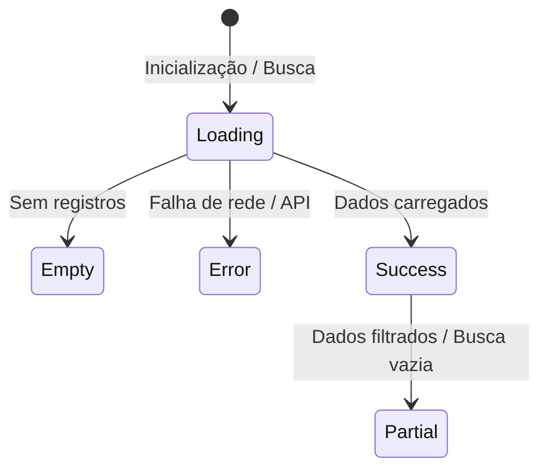
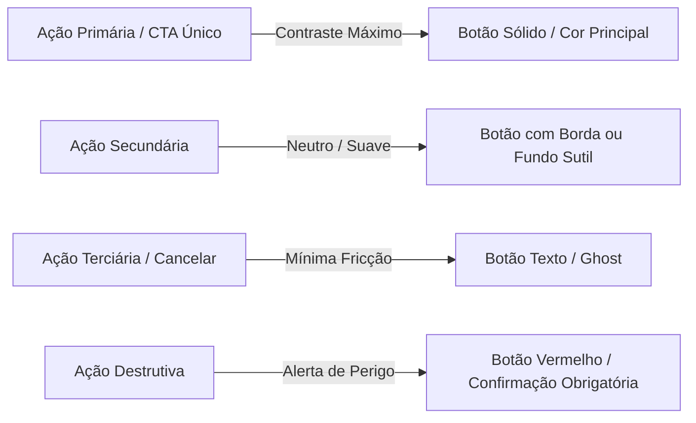

<!--
=================================================================================
LOG DE MANUTENÇÃO E ALTERAÇÕES DO DOCUMENTO
=================================================================================
Data       | Autor          | Descrição da Alteração
-----------|----------------|--------------------------------------------------
2026-08-18 | Matheus Diniz  | Criação do Guia Universal de Design, UI/UX e
           | (OpenClaude)   | Acessibilidade consolidando a skill /design-review
           |                | e as 5 Lentes Fundamentais (Arquitetura, Micro-UX,
           |                | Animação, Tipografia e Filtro Anti-Slop).
2026-08-18 | Matheus Diniz  | Inclusão de diretrizes mandatórias: componentes
           | (OpenClaude)   | in-house próprios (Anti-Material/PrimeNG bloat),
           |                | biblioteca padrão de ícones (Material Symbols/Icons)
           |                | e definição da fonte padrão canônica (Inter).
2026-08-18 | Matheus Diniz  | Adição da política estrita de "Tailwind CSS First":
           | (OpenClaude)   | uso prioritário de classes utilitárias e restrição
           |                | de CSS/SCSS personalizado apenas quando estritamente
           |                | indispensável.
2026-08-18 | Matheus Diniz  | Inclusão do planejamento arquitetural mandatório
           | (OpenClaude)   | para Tema Escuro (Dark Mode) e Tema de Alto
           |                | Contraste (High Contrast / WCAG AAA).
=================================================================================
-->

# 🎨 Guia Universal de Design de Interface (UI), Experiência do Usuário (UX) e Acessibilidade Digital (a11y)

> **Escopo do Documento:** Este guia é um manual **agnóstico a frameworks e tecnologias** (aplicável a Angular, React, Vue, Svelte, Next.js, Flutter, Tailwind CSS ou CSS Nativo). Ele estabelece os padrões institucionais de excelência visual, usabilidade ergonômica, conformidade estrita com acessibilidade (**WCAG 2.2 Níveis AA e AAA**), microinterações e qualidade estética contemporânea ("filtro anti-slop").

---

## 🧭 Visão Geral & O Framework das 5 Lentes

Para garantir que uma interface atinja a máxima qualidade funcional e emocional, todo componente, tela ou fluxo deve ser concebido e auditado através de **5 Lentes Complementares** originadas da competência `/design-review`:



---

## 🏛️ 1. Filosofia de Design & Princípios Norteadores

1. **Inclusão e Acessibilidade por Padrão (_Accessibility First_):** Uma interface não é bela se não puder ser operada por qualquer pessoa, em qualquer contexto, dispositivo ou condição sensorial/motora.
2. **Clareza sobre Decoração (_Function over Decoration_):** Cada cor, sombra, borda ou espaçamento deve ter uma função semântica e hierárquica clara. Se um elemento visual não comunica status, foco ou estrutura, elimine-o.
3. **Zero Fricção Cognitiva (_Don't Make Me Think_):** A jornada do usuário deve ser óbvia. Estados de espera, erros, ações primárias e caminhos de saída devem ser imediatamente reconhecíveis.
4. **Respeito ao Ritmo do Usuário (_Performance & Snappiness_):** Transições devem ser suaves e velozes (150ms a 300ms), nunca atrasando o fluxo de trabalho do usuário.
5. **Autenticidade e Fim do "AI Slop":** Interfaces corporativas modernas exigem sofisticação real — sombras em múltiplas camadas finas, tipografia com entrelinha precisa e contrastes calibrados, evitando clichês vazios como gradientes neon genéricos e cartões sem propósito.
6. **Componentes Próprios e Atômicos por Padrão (_In-House Design System First_):** Preferência mandatória por construir e manter nossos próprios componentes atômicos (UI in-house) em detrimento de bibliotecas pré-fabricadas e pesadas de terceiros (ex: Angular Material, PrimeNG, Bootstrap, Ant Design, MUI). Componentes próprios garantem controle total do DOM semântico, acessibilidade nativa sem hacks, ausência de CSS/JS bloating, bundle ultraleve e fidelidade visual absoluta à identidade do sistema.
7. **Tailwind CSS por Padrão (_Utility-First & Zero Arbitrary CSS_):** O desenvolvimento visual e estrutural deve ser realizado prioritariamente via classes utilitárias do Tailwind CSS. O uso de CSS/SCSS personalizado deve ser uma exceção rara, restrita apenas a casos estritamente indispensáveis (ex: animações `@keyframes` aceleradas por GPU, pseudo-elementos intrincados, variáveis CSS de temas globais ou regras de impressão).
8. **Planejamento Nativo Multi-Tema (Light, Dark e Alto Contraste):** Toda interface e componente deve ser concebido e validado desde o primeiro rascunho com suporte arquitetural aos 3 modos canônicos: **Tema Claro (Light)**, **Tema Escuro (Dark)** e **Tema de Alto Contraste (High Contrast / WCAG AAA)**. É expressamente vedado o uso de cores fixas ("hardcoded") que quebrem a inversão de luminosidade ou a distinção de bordas nos temas escuro e de alto contraste.

---

## 📐 2. Arquitetura de Layout, Grid e Espaçamento

O alinhamento matemático e o ritmo espacial são a espinha dorsal da ordem visual.

### 2.1. O Sistema de Grid Base de 4pt / 8pt

Todos os espaçamentos (`margin`, `padding`, `gap`), dimensões e alturas de linha devem ser múltiplos de **4px**, com preferência para saltos na escala de **8px**:

| Token Semântico          | Valor (px) | Valor (rem) | Uso Recomendado                                                             |
| :----------------------- | :--------- | :---------- | :-------------------------------------------------------------------------- |
| `space-1` / `space-xxs`  | `4px`      | `0.25rem`   | Micro-ajustes, espaçamento interno de badges, gap entre ícone e texto curto |
| `space-2` / `space-xs`   | `8px`      | `0.5rem`    | Padding interno de botões compactos, gap de itens em dropdowns              |
| `space-3` / `space-sm`   | `12px`     | `0.75rem`   | Padding de inputs, espaçamento entre campos compactos                       |
| `space-4` / `space-md`   | `16px`     | `1.0rem`    | Espaçamento padrão de cartões, paddings internos de células de tabela       |
| `space-6` / `space-lg`   | `24px`     | `1.5rem`    | Gaps entre cartões, separação de blocos lógicos em formulários              |
| `space-8` / `space-xl`   | `32px`     | `2.0rem`    | Margens de seções principais, padding interno de modais e drawers           |
| `space-12` / `space-2xl` | `48px`     | `3.0rem`    | Separação entre grandes blocos de página, hero sections                     |

```css
/* ✅ DO: Espaçamentos na escala regular de 8pt */
.card-container {
  padding: 1.5rem; /* 24px */
  display: flex;
  flex-direction: column;
  gap: 1rem; /* 16px */
}

/* ❌ DON'T: Valores arbitrários que quebram o ritmo visual */
.card-container-bad {
  padding: 19px;
  gap: 13px;
}
```

### 2.2. Camadas e Hierarquia de Z-Index

Evite números mágicos como `z-index: 99999`. Utilize uma escala padronizada de elevações:

```css
:root {
  --z-base: 0;
  --z-elevated: 10; /* Cards flutuantes, tabelas fixas */
  --z-sticky: 100; /* Headers e sidebars coladas */
  --z-drawer: 200; /* Painéis laterais deslizantes */
  --z-backdrop: 300; /* Máscara escura de fundo */
  --z-modal: 400; /* Janelas de diálogo e modais */
  --z-popover: 500; /* Dropdowns, tooltips, select pickers */
  --z-toast: 1000; /* Notificações globais e alertas críticos */
}
```

### 2.3. Diretriz de Estilização: Tailwind CSS First & Uso Restrito de CSS/SCSS

Para assegurar consistência visual, ausência de código duplicado, zero _CSS dead code_ e bundles ultracompactos gerados via compilador JIT:

1. **Tailwind CSS como Padrão Obrigatório:** Todo o estilo de componentes e páginas (layout flexbox/grid, paddings, margins, tipografia, bordas, cores, estados `:hover`, `:focus` e transições) deve ser construído diretamente no template com classes utilitárias do Tailwind CSS.
2. **Quando é Permitido Escrever CSS/SCSS Customizado (Exceções Estritas):**
   - Definição de **Tokens Globais e Variáveis CSS** (`:root`, `.theme-dark`, `.theme-high-contrast`).
   - Animações complexas de aceleração por hardware (`@keyframes`) que demandem múltiplos estágios ou curvas de Bezier não padronizadas.
   - Pseudo-elementos complexos (`::before`, `::after`) com camadas e geometrias intrincadas.
   - Regras específicas de mídia de impressão (`@media print`).
   - Customização de barras de rolagem nativas (`::-webkit-scrollbar`).
3. **Proibição de Estilos Paralelos Redundantes:** É expressamente proibido criar blocos ou arquivos `.scss`/`.css` paralelos apenas para replicar regras triviais já atendidas pelo Tailwind (ex: criar classes personalizadas com apenas `display: flex`, `padding: 16px` ou `border-radius: 8px`).

---

## 🔤 3. Tipografia & Hierarquia de Leitura

A tipografia é responsável por mais de 80% da comunicação em uma interface web.

### 3.1. Escala Modular Tipográfica

Use uma escala proporcional (Major Second 1.125x ou Minor Third 1.2x) para garantir contraste claro entre títulos e corpo:

| Nível / Tag            | Tamanho (px / rem) | Peso (Weight)    | Entrelinha (`line-height`) | Espaçamento (`letter-spacing`) |
| :--------------------- | :----------------- | :--------------- | :------------------------- | :----------------------------- |
| **Display / H1**       | `32px / 2.0rem`    | `700 (Bold)`     | `1.2 (38.4px)`             | `-0.025em` (tracking tight)    |
| **Título 1 / H2**      | `24px / 1.5rem`    | `600 (Semibold)` | `1.25 (30px)`              | `-0.02em`                      |
| **Título 2 / H3**      | `20px / 1.25rem`   | `600 (Semibold)` | `1.3 (26px)`               | `-0.015em`                     |
| **Subtítulo / H4**     | `18px / 1.125rem`  | `600 (Semibold)` | `1.35 (24px)`              | `-0.01em`                      |
| **Corpo (Base)**       | `16px / 1.0rem`    | `400 (Regular)`  | `1.5 (24px)`               | `0em` (normal)                 |
| **Corpo Enfático**     | `16px / 1.0rem`    | `500 (Medium)`   | `1.5 (24px)`               | `0em`                          |
| **Secundário / Small** | `14px / 0.875rem`  | `400 (Regular)`  | `1.4 (19.6px)`             | `0em`                          |
| **Legenda / Micro**    | `12px / 0.75rem`   | `500 (Medium)`   | `1.3 (15.6px)`             | `+0.01em`                      |

### 3.2. Regras de Ouro de Tipografia

1. **Comprimento de Linha de Leitura (_Measure_):** Parágrafos devem conter entre **45 e 75 caracteres por linha** (idealmente `max-w-prose` ou `65ch`). Linhas muito longas cansam a visão; muito curtas quebram o fluxo de raciocínio.
2. **Entrelinha Proporcional (_Line Height_):** Textos grandes exigem entrelinhas menores (`1.15` a `1.25`). Textos de leitura contínua exigem entrelinha confortável (`1.5` a `1.6`).
3. **Contraste de Peso:** Evite usar muitos pesos na mesma página. Concentre-se em **3 pesos**: `400 (Regular)`, `500 (Medium)` e `600 (Semibold)` ou `700 (Bold)`.
4. **Font Pairing:** Use no máximo duas famílias tipográficas — uma fonte de personalidade ou sem serifa neutra moderna para títulos (ex: _Inter_, _Outfit_, _Plus Jakarta Sans_) e uma fonte altamente legível para dados e interface (_Inter_, _Geist_, _Roboto_).

### 3.3. Fonte Padrão Canônica do Sistema

Salvo especificação explícita em contrário documentada no escopo ou identidade visual de um projeto específico, a família tipográfica padrão oficial para todo o ecossistema é **Inter** (com `Roboto` como suporte auxiliar/fallback para dados):

```css
:root {
  --font-family-base:
    'Inter', ui-sans-serif, system-ui, -apple-system, BlinkMacSystemFont, 'Segoe UI', Roboto,
    'Helvetica Neue', Arial, sans-serif;
  --font-family-mono: ui-monospace, SFMono-Regular, Menlo, Monaco, Consolas, monospace;
}

body {
  font-family: var(--font-family-base);
}
```

- **Por que Inter?** Excelente legibilidade em telas digitais de qualquer densidade de pixels, kerning refinado, suporte nativo a numerais tabulares para tabelas financeiras e neutralidade estética contemporânea.

### 3.4. Iconografia & Biblioteca Padrão de Ícones

A consistência iconográfica é indispensável para o reconhecimento visual rápido e harmonia estética:

1. **Biblioteca Padrão Mandatória:** Utilize sempre a biblioteca de ícones padronizada do sistema — por padrão, **Material Symbols Outlined** (ou **Material Icons**).
2. **Proibição Estrita de Mistura (_No Icon Slop_):** É expressamente proibido mesclar diferentes bibliotecas de ícones na mesma aplicação ou tela (ex: misturar FontAwesome, Lucide e Material Symbols). A biblioteca unificada garante espessura de traço homogênea (_stroke weight_), alinhamento óptico coerente e grid vetorial regular.
3. **Escala Padronizada de Tamanhos de Ícones:**
   - **Micro (`16px` / `w-4 h-4`):** Badges, micro-tags, sufixos compactos de inputs.
   - **Padrão de Interface (`20px` / `w-5 h-5`):** Botões, itens de menu lateral, alertas de campos.
   - **Destaque / Ação (`24px` / `w-6 h-6`):** Títulos de cartões, botões de ação flutuantes, headers de modais.
   - **Hero / Empty States (`40px` a `48px` / `w-10 h-10` a `w-12 h-12`):** Ilustrações de estado vazio e feedbacks centrais.
4. **Acessibilidade em Ícones:**
   - **Ícone Decorativo:** Quando acompanhado de texto visível, declare sempre `aria-hidden="true"` (ex: `<span class="material-symbols-outlined" aria-hidden="true">download</span>`).
   - **Ícone como Ação Isolada (Icon-only Button):** Exija obrigatoriamente `aria-label="Descrição da ação"` no botão contenedor ou insira um `<span class="sr-only">Texto</span>`.

---

## 🎨 4. Cores, Contraste e Tokens Semânticos

Cores constroem significado e direcionam a atenção para o que realmente importa.

### 4.1. A Regra 60-30-10 da Distribuição de Cor

- **60% Cor Dominante Neutra:** Fundos, telas, superfícies de cartões (`canvas`, `surface`, `card`).
- **30% Cor Estrutural / Secundária:** Tipografia principal, bordas, ícones neutros, tabelas (`ink`, `slate`, `border`).
- **10% Cor de Acento / Ação Principal:** Botões primários, links ativos, badges de status, indicadores de foco (`primary`, `brand`).

### 4.2. Tokens Semânticos de Superfície e Conteúdo

```css
/* ==========================================================================
   TEMA 1: CLARO (Light Theme - Padrão Corporativo Arejado)
   ========================================================================== */
:root,
.theme-light {
  /* Superfícies & Fundos */
  --surface-canvas: #f8fafc; /* Fundo base da aplicação */
  --surface-card: #ffffff; /* Cartões, painéis, modais */
  --surface-subtle: #f1f5f9; /* Hover de linhas, inputs desabilitados */

  /* Textos & Conteúdo */
  --text-primary: #0f172a; /* Títulos e corpo principal (contraste ≥ 12:1) */
  --text-secondary: #475569; /* Rótulos e textos explicativos (contraste ≥ 4.5:1) */
  --text-muted: #64748b; /* Placeholders e hints secundários */
  --text-inverse: #ffffff; /* Texto sobre fundos escuros/primários */

  /* Linhas & Divisores */
  --border-subtle: rgba(0, 0, 0, 0.06);
  --border-default: #e2e8f0;
  --border-strong: #cbd5e1;
  --border-focus: #3b82f6;

  /* Ações & Semântica */
  --color-primary: #1e6ef4;
  --color-primary-hover: #1557c0;
  --status-success: #10b981;
  --status-success-subtle: #ecfdf5;
  --status-warning: #f59e0b;
  --status-warning-subtle: #fffbeb;
  --status-danger: #ef4444;
  --status-danger-subtle: #fef2f2;
  --status-info: #0284c7;
  --status-info-subtle: #f0f9ff;
}

/* ==========================================================================
   TEMA 2: ESCURO (Dark Mode - Conforto Visual & Profundidade)
   ========================================================================== */
@media (prefers-color-scheme: dark), [data-theme='dark'], .theme-dark {
  :root {
    /* Superfícies em Camadas (Elevação por Luminosidade, não por sombra) */
    --surface-canvas: #0f172a; /* Nível 0: Fundo da janela (azul profundo) */
    --surface-card: #1e293b; /* Nível 1: Cartões e containers elevados */
    --surface-subtle: #334155; /* Nível 2: Hovers, popovers e inputs */

    /* Textos Desaturados (Evitam ofuscamento e fadiga visual) */
    --text-primary: #f8fafc; /* Contraste ≥ 13:1 */
    --text-secondary: #94a3b8; /* Contraste ≥ 5.2:1 */
    --text-muted: #64748b;
    --text-inverse: #0f172a;

    /* Bordas Translúcidas Delicadas */
    --border-subtle: rgba(255, 255, 255, 0.08);
    --border-default: #334155;
    --border-strong: #475569;
    --border-focus: #60a5fa;

    /* Ações com Cores Calibradas */
    --color-primary: #3b82f6;
    --color-primary-hover: #2563eb;
    --status-success: #34d399;
    --status-success-subtle: rgba(52, 211, 153, 0.12);
    --status-warning: #fbbf24;
    --status-warning-subtle: rgba(251, 191, 36, 0.12);
    --status-danger: #f87171;
    --status-danger-subtle: rgba(248, 113, 113, 0.12);
    --status-info: #38bdf8;
    --status-info-subtle: rgba(56, 189, 248, 0.12);
  }
}

/* ==========================================================================
   TEMA 3: ALTO CONTRASTE (High Contrast - WCAG AAA & Baixa Visão)
   ========================================================================== */
@media (prefers-contrast: more), [data-theme='high-contrast'], .theme-high-contrast {
  :root {
    /* Fundo Preto Absoluto / Máxima Distinção */
    --surface-canvas: #000000;
    --surface-card: #090d16;
    --surface-subtle: #172033;

    /* Textos de Contraste Extremo (≥ 15:1) */
    --text-primary: #ffffff;
    --text-secondary: #facc15; /* Amarelo de altíssima legibilidade */
    --text-muted: #fef08a;
    --text-inverse: #000000;

    /* Bordas Hiper-Visíveis e Definidas */
    --border-subtle: #facc15;
    --border-default: #facc15;
    --border-strong: #ffffff;
    --border-focus: #ffffff;

    /* Ações em Alta Visibilidade */
    --color-primary: #facc15;
    --color-primary-hover: #eab308;
    --status-success: #4ade80;
    --status-success-subtle: rgba(74, 222, 128, 0.2);
    --status-warning: #facc15;
    --status-warning-subtle: rgba(250, 204, 21, 0.2);
    --status-danger: #f87171;
    --status-danger-subtle: rgba(248, 113, 113, 0.2);
    --status-info: #38bdf8;
    --status-info-subtle: rgba(56, 189, 248, 0.2);
  }
}
```

### 4.3. Diretrizes de Planejamento para Dark Mode e Alto Contraste

O suporte a múltiplos temas deve ser estrutural e não um ajuste cosmético tardio:

1. **Ergonomia do Dark Mode:**
   - **Nunca use preto puro (`#000000`) para o fundo geral:** Utilize bases de grafite ou azul profundo (ex: `#0f172a` ou `#121212`) para mitigar a fadiga ocular em sessões prolongadas.
   - **Elevação por Luminosidade:** No tema escuro, sombras tornam-se quase invisíveis. A hierarquia e elevação de modais, drawers e cartões devem ser comunicadas clareando progressivamente a cor de fundo da superfície (`canvas: #0f172a` → `card: #1e293b` → `modal: #334155`).
   - **Desaturação de Cores:** Cores saturadas demais causam aberração cromática contra fundos escuros. Utilize variações mais claras e suaves das cores primárias e de status (ex: troque `#1e6ef4` por `#3b82f6` ou `#60a5fa`).
2. **Arquitetura do Tema de Alto Contraste (WCAG AAA):**
   - **Rácios Extremos de Contraste:** Todos os textos devem cumprir ou exceder o rácio de **7:1** (Nível AAA) contra o fundo.
   - **Bordas Obrigatórias:** Desative sombras difusas e substitua por bordas sólidas de contraste extremo (`1px solid #facc15` ou `1px solid #ffffff`), garantindo separação tátil e visual clara entre os elementos.
   - **Eliminação de Transparências e Blurs:** Desative `backdrop-filter: blur()` e fundos translúcidos no tema de alto contraste, garantindo opacidade total (100%) para não comprometer a leitura de usuários com deficiência visual severa ou astigmatismo elevado.
   - **Suporte ao Modo de Cores Forçadas do SO:** Adicione suporte nativo a `@media (forced-colors: active)` para garantir compatibilidade com o recurso de alto contraste do sistema operacional (Windows High Contrast Mode, macOS Increase Contrast).

---

## ♿ 5. Acessibilidade Universal (WCAG 2.2 Níveis AA e AAA)

Acessibilidade não é opcional nem recurso para "depois". É um requisito básico de engenharia.

### 5.1. Regras de Contraste Cromático

- **Texto Normal (< 18pt / 24px regular):** Proporção de contraste mínima de **4.5:1** (Nível AA) ou **7.0:1** (Nível AAA) contra o fundo.
- **Texto Grande (≥ 18pt / 24px regular ou ≥ 14pt / 18.6px bold):** Proporção mínima de **3.0:1** (AA) ou **4.5:1** (AAA).
- **Componentes de Interface & Ícones Essenciais:** Proporção mínima de **3.0:1** contra elementos adjacentes.
- **Aviso:** Nunca transmita informação **apenas pela cor**. Sempre acompanhe com texto, ícone explicativo ou padrão gráfico (ex: ícone de alerta junto ao texto vermelho).

### 5.2. Navegação Completa por Teclado & Gestão de Foco

1. **Foco Visível Obrigatório (`:focus-visible`):** Nunca use `outline: none` sem fornecer um anel de foco visível e destacado (`ring-2 ring-primary ring-offset-2`).
2. **Ordem Lógica do DOM:** A navegação por tecla `Tab` deve seguir rigorosamente a ordem visual da tela.
3. **Trap de Foco em Modais:** Quando um modal ou drawer for aberto, o foco deve ser aprisionado dentro dele, impedindo a navegação no conteúdo de fundo. Ao fechar com `Esc`, retorne o foco para o elemento que disparou a abertura.
4. **Skip Links:** Forneça atalho de pular para o conteúdo principal (`Skip to main content`) no topo do site para leitores de tela e usuários de teclado.

```html
<!-- ✅ Exemplo Canônico de Foco e Acessibilidade em Botão -->
<button
  type="button"
  class="btn-primary"
  aria-label="Exportar relatório de despesas em formato PDF"
  aria-busy="false"
>
  <svg aria-hidden="true" class="h-5 w-5">...</svg>
  <span>Exportar PDF</span>
</button>
```

```css
/* ✅ Anel de Foco Acessível Universal */
.btn-primary:focus-visible,
input:focus-visible,
select:focus-visible {
  outline: 2px solid transparent;
  outline-offset: 2px;
  box-shadow:
    0 0 0 2px var(--surface-card),
    0 0 0 4px var(--border-focus);
}
```

### 5.3. Acessibilidade Motora & Alvos de Toque (_Touch Targets_)

- **Tamanho Mínimo de Alvo Interativo:** Todo elemento clicável ou tocável (botão, link, checkbox, switch, ícone de ação) deve ter uma área clicável de pelo menos **44px × 44px** (WCAG 2.5.5 / 2.5.8).
- **Espaçamento entre Alvos:** Pelo menos **8px** de espaçamento entre elementos tocáveis adjacentes para evitar toques acidentais.

### 5.4. Respeito ao Modo de Movimento Reduzido (_Reduced Motion_)

Sempre respeite as preferências do sistema operacional de usuários sensíveis a vertigem e animações:

```css
@media (prefers-reduced-motion: reduce) {
  *,
  *::before,
  *::after {
    animation-duration: 0.01ms !important;
    animation-iteration-count: 1 !important;
    transition-duration: 0.01ms !important;
    scroll-behavior: auto !important;
  }
}
```

---

## 💎 6. Micro-UX, Estados de Interface e Prevenção de Fricção

Uma interface madura brilha nos detalhes e no tratamento gracioso de todos os estados possíveis.

### 6.1. A Regra dos 5 Estados de Qualquer Componente/Tela

Todo componente de dados ou tela deve prever e desenhar explicitamente:



1. **Estado Inicial / Loading (Carregamento):**
   - Use **Skeleton Screens** com as mesmas dimensões e formatos do conteúdo real em vez de spinners genéricos no meio da tela.
   - Skeletons previnem **Cumulative Layout Shift (CLS)** e transmitem sensação de velocidade.
2. **Estado Vazio (Empty State):**
   - Nunca mostre uma tela em branco. Explique o que deveria estar ali, por que está vazio e forneça um botão de ação primária (CTA) claro para criar o primeiro item.
3. **Estado de Erro (Error State):**
   - Forneça mensagens em linguagem humana e clara (evite "Error 500: Internal server error").
   - Ofereça uma ação imediata de recuperação (ex: botão "Tentar Novamente").
4. **Estado de Sucesso / Preenchido (Success State):**
   - Dados organizados, tabelas com paginação limpa e cards bem delimitados.
5. **Estado Desabilitado (Disabled State):**
   - Explique **por que** o botão está desabilitado através de um `tooltip` ou texto auxiliar abaixo do botão se houver pré-requisitos não preenchidos.

### 6.2. Formulários, Inputs e Validação sem Fricção

- **Labels Visíveis:** Nunca substitua a tag `<label>` por um `placeholder`. O placeholder desaparece ao digitar e prejudica a memória do usuário.
- **Validação em Tempo Oportuno (_Inline Validation_):**
  - Não mostre erros vermelhos enquanto o usuário ainda está digitando.
  - Valide no evento `onBlur` (ao sair do campo) ou após o clique no botão de envio.
  - Ao corrigir o campo com erro, limpe a mensagem de erro imediatamente `onInput`.
- **Prevenção de Perda de Dados:** Se um formulário com dados não salvos for fechado, exiba um diálogo de confirmação amigável.
- **Máscaras e Teclados Virtuais Adequados:** Use `type="email"`, `type="tel"`, `inputmode="numeric"` para acionar o teclado correto em dispositivos móveis.

---

## ⚡ 7. Animação, Transições e Fluidez Interativa

A animação em software existe para criar continuidade espacial e fornecer confirmação física de toque.

### 7.1. Princípios de Movimento Eficiente

1. **Durações Curtas e Previsíveis:**
   - Microinterações de hover/foco: **100ms a 150ms**.
   - Entradas de modais, drawers e abas: **200ms a 300ms**.
   - Notificações de Toast: **250ms**.
   - Nunca ultrapasse 400ms para ações rotineiras de interface.
2. **Curvas de Aceleração Orgânicas (_Easing_):**
   - Evite `linear` e `ease-in-out` padrão para movimentos de entrada.
   - Use curvas de desaceleração suave: `cubic-bezier(0.16, 1, 0.3, 1)` (smooth ease-out) ou `cubic-bezier(0.4, 0, 0.2, 1)` (material standard).
3. **Performance Visual & Aceleração por GPU:**
   - Anime **apenas** propriedades compostas pela GPU: `transform` (scale, translate) e `opacity`.
   - **Proibido animar:** `height`, `width`, `top`, `left`, `margin` ou `padding` diretamente, pois causam repinturas completas da página (_Layout Repaint/Reflow_).

```css
/* ✅ Animação Leve e Fluida com Aceleração de Hardware */
.drawer-panel {
  transform: translateX(100%);
  opacity: 0;
  transition:
    transform 280ms cubic-bezier(0.16, 1, 0.3, 1),
    opacity 200ms ease-out;
  will-change: transform, opacity;
}

.drawer-panel.is-open {
  transform: translateX(0);
  opacity: 1;
}
```

---

## ✨ 8. Qualidade Estética & Filtro Anti-Slop

O design refinado é reconhecido pelo que elimina tanto quanto pelo que constrói.

```mermaid
graph LR
    subgraph AntiPattern[❌ Clichês Genéricos de IA (AI Slop)]
        A[Sombras Borradas Monolíticas]
        B[Gradientes Neon sem Contraste]
        C[Cartões Flutuantes sem Borda]
        D[Bordas Arredondadas Excessivas]
    end

    subgraph Craft[✅ Design Refinado & Profissional]
        E[Layered Shadows em Múltiplas Camadas]
        F[Cores Sólidas & Contrastes Acessíveis]
        G[Bordas Finas Translúcidas com RGBA]
        H[Escala de Raio Consistente: 8/12/16px]
    end

    AntiPattern -.->|Refatoração & Elevação| Craft
```

### 8.1. Sombras em Múltiplas Camadas (_Layered Shadows_)

Substitua sombras pretas borradas e duras por sobreposições sutis em camadas:

```css
/* ✅ Sombras Refinadas em Camadas (Layered Elevation) */
:root {
  /* Nível 1: Cartões e superfícies baixas */
  --shadow-sm: 0 1px 2px 0 rgba(0, 0, 0, 0.04), 0 1px 3px 1px rgba(0, 0, 0, 0.02);

  /* Nível 2: Dropdowns e cartões em hover */
  --shadow-md:
    0 4px 6px -1px rgba(0, 0, 0, 0.05), 0 2px 4px -2px rgba(0, 0, 0, 0.03),
    0 0 0 1px rgba(0, 0, 0, 0.04);

  /* Nível 3: Modais, Drawers e Diálogos */
  --shadow-lg:
    0 10px 15px -3px rgba(0, 0, 0, 0.06), 0 4px 6px -4px rgba(0, 0, 0, 0.04),
    0 0 0 1px rgba(0, 0, 0, 0.05);

  /* Nível 4: Notificações Flutuantes (Toasts) */
  --shadow-xl:
    0 20px 25px -5px rgba(0, 0, 0, 0.08), 0 8px 10px -6px rgba(0, 0, 0, 0.04),
    0 0 0 1px rgba(0, 0, 0, 0.06);
}
```

### 8.2. Bordas Sutis & Efeito de Vidro Fosco (_Glassmorphism com Propósito_)

O efeito de vidro fosco (`backdrop-filter: blur()`) deve ser usado estritamente em elementos flutuantes sobrepostos (como headers fixos e sidebars flutuantes), mantendo legibilidade absoluta:

```css
/* ✅ Header Flutuante Elegante e Acessível */
.glass-surface {
  background-color: rgba(255, 255, 255, 0.82);
  backdrop-filter: blur(12px) saturate(160%);
  -webkit-backdrop-filter: blur(12px) saturate(160%);
  border: 1px solid rgba(226, 232, 240, 0.8);
}

[data-theme='dark'] .glass-surface {
  background-color: rgba(15, 23, 42, 0.82);
  border-color: rgba(255, 255, 255, 0.08);
}
```

### 8.3. Escala Consistente de Arredondamento (`border-radius`)

Evite usar `rounded-full` em botões retangulares comuns ou `rounded-3xl` em cartões pequenos. Adote uma escala harmoniosa:

- **Tags / Badges / Pílulas:** `rounded-full` (`9999px`)
- **Inputs & Botões:** `rounded-lg` (`8px` a `10px`)
- **Cartões & Painéis:** `rounded-xl` (`12px` a `16px`)
- **Modais & Caixas Grandes:** `rounded-2xl` (`16px` a `20px`)

---

## 📱 9. Responsividade, Adaptação e Mobile-First UX

Uma experiência web deve ser contínua em telas de 320px até 4K.

### 9.1. Breakpoints Padrão Universais

| Breakpoint                 | Prefixo | Largura Mínima | Dispositivo Alvo                                      |
| :------------------------- | :------ | :------------- | :---------------------------------------------------- |
| **Mobile Pequeno**         | `xs`    | `375px`        | Smartphones padrão                                    |
| **Mobile Grande / Tablet** | `sm`    | `640px`        | Telefones grandes em paisagem / tablets compactos     |
| **Tablet Médio**           | `md`    | `768px`        | iPads e tablets                                       |
| **Desktop / Laptop**       | `lg`    | `1024px`       | Laptops comuns e telas médias                         |
| **Desktop Grande**         | `xl`    | `1280px`       | Monitores de alta definição                           |
| **Ultra-Wide**             | `2xl`   | `1536px`       | Telas ultra-largas (aplicar `max-w-7xl` centralizado) |

### 9.2. Adaptação de Padrões Interativos (Desktop vs Mobile)

- **Tabelas Complexas:**
  - _Desktop:_ Tabela completa com paginação e ordenação por colunas.
  - _Mobile:_ Transforme cada linha da tabela em um **Card de Resumo Expansível** para evitar scroll horizontal desconfortável.
- **Modais e Diálogos:**
  - _Desktop:_ Janela centralizada com backdrop escurecido.
  - _Mobile:_ **Bottom Sheet** ancorado no rodapé com gesto de arraste para fechar (_swipe-to-dismiss_).
- **Áreas Seguras de Tela (_Safe Areas_):**
  - Sempre declare `padding-bottom: env(safe-area-inset-bottom)` em barras fixas no rodapé para não colidir com a barra de navegação do iOS/Android.

---

## 🛠️ 10. Formulários, Inputs e Design de Ações

Formulários são o ponto crítico de conversão e entrada de dados em qualquer sistema.

### 10.1. Hierarquia de Ações (Botões e CTAs)

Nunca coloque dois botões de ação primária lado a lado no mesmo bloco visual:



### 10.2. Ações Destrutivas & Confirmação em Duas Etapas

1. **Nunca execute exclusões permanentes com um único clique.**
2. Ações irreversíveis (ex: cancelar contrato, excluir registro de despesa, revogar acesso) devem exigir:
   - Diálogo modal explícito com o título claro da ação.
   - Resumo do impacto da exclusão.
   - Botão de confirmação em tom de perigo (`var(--status-danger)`).
   - Para operações de altíssimo risco, solicite ao usuário digitar uma palavra de confirmação (ex: digitar "EXCLUIR" ou o nome do recurso).

### 10.3. Componentes Próprios (In-House) vs. Bibliotecas de Terceiros

Para garantir máxima performance, acessibilidade e alinhamento visual, adotamos uma política estrita de **construção e reutilização de componentes próprios atômicos** (ex: botões, inputs, selects, modais, datepickers, toasts, tabelas), rejeitando bibliotecas pré-fabricadas pesadas (como Angular Material, PrimeNG, Bootstrap, MUI, Ant Design):

1. **Zero Bloat & CSS Puro:** Bibliotecas de terceiros trazem centenas de kilobytes de CSS e JS desnecessários, além de forçar hacks de especificidade (`::ng-deep`, `!important`) para customização.
2. **Controle Total do DOM e Acessibilidade:** Componentes desenvolvidos internamente garantem HTML semântico limpo, controle direto sobre atributos `aria-*`, gerenciamento de foco nativo e conformidade estrita com WCAG 2.2.
3. **Harmonia e Fidelidade Visual 100%:** Nossos componentes compartilham nativamente os mesmos tokens semânticos de cores, sombras e raios de borda, eliminando discrepâncias visuais.
4. **Facilidade de Manutenção e Independência:** Evitamos quebras de versão causadas por atualizações de dependências de terceiros ou incompatibilidades com novas versões do framework.

---

## 📋 11. Scorecard e Checklist de Auditoria `/design-review`

Utilize esta matriz como roteiro compulsório de auditoria antes de lançar qualquer nova tela ou componente em produção:

### 📊 Matriz de Avaliação (0 a 10 Pontos por Dimensão)

| Dimensão                       | Critérios de Avaliação                                                                                                     | Nota (0-10) |  Status  |
| :----------------------------- | :------------------------------------------------------------------------------------------------------------------------- | :---------: | :------: |
| **1. Arquitetura & UX**        | Grid 4/8pt, hierarquia visual, contraste WCAG 2.2 AA (≥ 4.5:1), Tailwind CSS First e componentes in-house sem libs pesadas |   `__/10`   | 🟢/🟡/🔴 |
| **2. Polimento & Micro-UX**    | 5 estados (Loading, Empty, Error, Success, Disabled), skeletons sem CLS, touch targets ≥ 44px                              |   `__/10`   | 🟢/🟡/🔴 |
| **3. Animação & Interação**    | Durações ágeis (150-300ms), aceleração GPU (transform/opacity), feedback tátil e reduced motion                            |   `__/10`   | 🟢/🟡/🔴 |
| **4. Tipografia & Identidade** | Escala modular, measure de 45-75ch, fonte Inter por padrão, biblioteca de ícones padronizada (Material Symbols)            |   `__/10`   | 🟢/🟡/🔴 |
| **5. Estética & Multi-Tema**   | Suporte aos 3 temas (Claro, Escuro e Alto Contraste AAA), elevação por luminosidade, zero cores hardcoded, zero AI slop    |   `__/10`   | 🟢/🟡/🔴 |

> **Pontuação Geral do Componente/Tela:** `___ / 50 Pontos`
>
> - **45 a 50 Pontos:** 🟢 **Aprovado com Excelência (Pronto para Produção)**
> - **35 a 44 Pontos:** 🟡 **Aprovado com Ressalvas (Ajustes finos recomendados)**
> - **Abaixo de 35 Pontos:** 🔴 **Reprovado (Requer refatoração estrutural)**

---

## 🏁 Conclusão & Aplicação Inter-Projetos

Este guia deve ser adotado como a especificação de engenharia de frontend de referência para novos repositórios e produtos digitais.

Ao iniciar um novo projeto:

1. Copie e adote as variáveis de **Tokens Semânticos** dos **3 Temas (Claro, Escuro e Alto Contraste)** e a escala de **Espaçamentos 8pt**.
2. Configure a fonte padrão institucional **Inter** e a biblioteca unificada de ícones **Material Symbols Outlined** (ou Material Icons).
3. Construa ou utilize os componentes atômicos próprios (**In-House Design System**), evitando bibliotecas de terceiros pré-moldadas.
4. Adote **Tailwind CSS** para toda a estilização utilitária de componentes, restringindo CSS/SCSS apenas a casos estritamente indispensáveis.
5. Planeje e valide cada tela nos 3 modos visuais: **Light**, **Dark** e **Alto Contraste**.
6. Configure as regras de acessibilidade e os alvos de toque mínimos de **44px**.
7. Aplique a skill `/design-review` em cada PR ou componente desenvolvido para garantir conformidade contínua com esta especificação.
